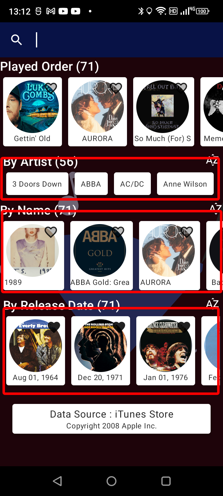
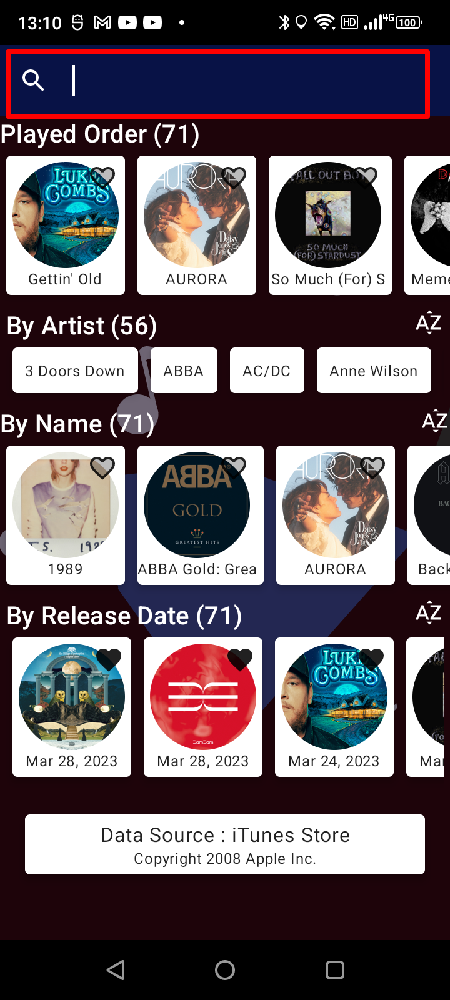
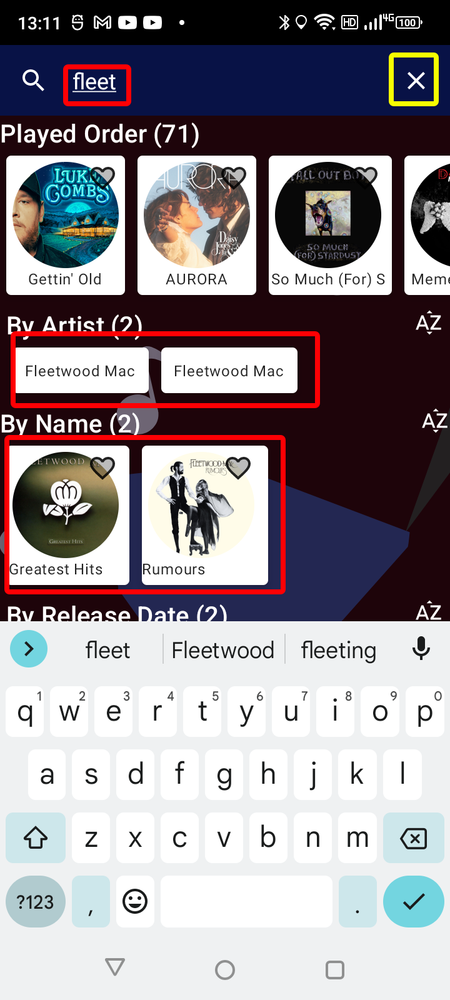
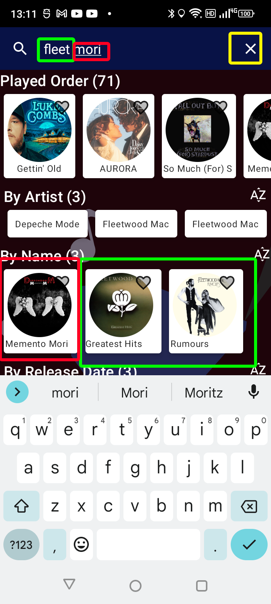
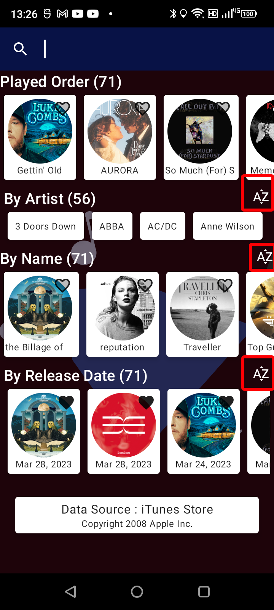
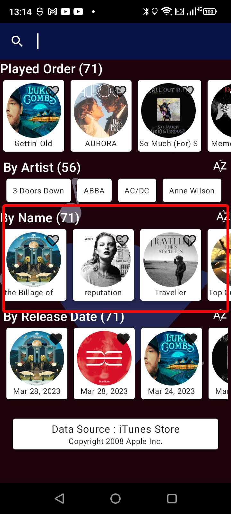
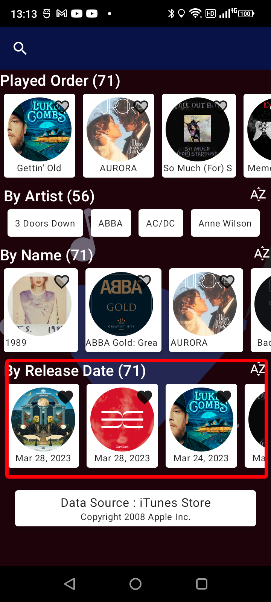

# Additional Features

## Overview

The number behind the carousel name shows the number of items in the carousel.

The "Play Order Carousel" will always show all items in the order they came from the server.

The "Search capabilities" run on local data and will be reflected in the carousel below the played items.

The "Sort" feature runs local sorting. This feature uses the "Jetpack Flow" to preset the changes in realtime.

### Default Landing Page
The carousels will be sorted ascending by default.

 

# Generic Search

## Search bar
The search bar will be displayed at the top of the screen, 
- Select the magnify glass to start searching.
- To clear the search select X or clear contents.

The search will be applied across the multiple fields for each entry, the search will automatically search each word separated by a space.

For MVP Drop 1 all results will only be reflected in the landing page.

### Search Bar

### Single / Part word search

### Multiple part word search

# Carousel Sorting 

### Overview
When the user selects the sort feature it will toggle the carousel data, this will sort the data based on the carousel type.

## Sort buttons
The sort buttons toggle the data specific to the carousel.

### Albums sort toggled.

### Release date sort toggled

