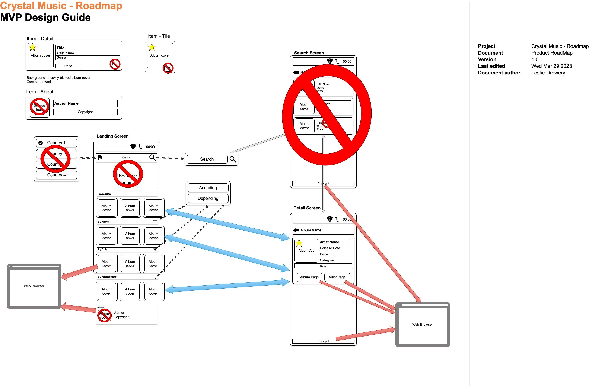

# Product Roadmap

---

## NOTE:

This application is purely designed and build for evaluation purposes and must not be distributed or used for any other purpose.

## In lue of licencing verification

- Data will only be available while online.

- NO data will be retained after the application is closed.

- Some media might contain additional licencing and should not be used for any other purposes than this evaluation.

## Assumptions

- Feed supplied in the readme will be the single source of truth, any additional 3rd party data should be treated as unverified data.

- Upon verification of the data returned via the feed, if any fields contain invalid data will be excluded from this evalution as a whole.

- Wireframes are only used to as a guide and final product might not match.

- Data retrieved must not exceed 100 records.

- All searches will only be done on data retreived in the current instance.

## Knowledge gaps.

- This is by far the weakest area of my skill set,
  UI Testing was in it's infancy on my previous commercial project (celenium, Gerkin and intergration with Jira.)

- Expressio knowledge is rudimentry

---

# RoadMap

## RoadMap

## MVP-Drop 1 (Supplied for evaluation)

### Landing Screen.

1. WHEN Internet is not available THEN Show error dialog with message "Internet required for this app" and then exit.

2. WHEN search terms are entered in search block AND search is selected THEN launch search screen with search criteria.

3. Country selection out of scope will be locked to US.

4. WHEN there is data for a given carousel THEN "item tile" is to be used for each item scrolling horizontally.

5. GIVEN data is retrieved WHEN there are no items meeting the filter criteria for a given carousel THEN hide the carousel.

---

| Carousel | Filter per item |
| ----------- | ----------- |
| Favourites | There are favourites stored locally and they are in data retrieved |
| "By Name" | There album names in data retrieved |
| "By Artist" | There artist names in data retrieved |
| "By Release Date" | There is a released date in data retrieved |

---

6. GIVEN that the author and copyright details are available THEN the last item in the carousel needs to hold icon, name and copyright
   using "Item About".

7. WHEN the sort icon per carousel is selected THEN the data will toggle state from ascend -> decending or decending -> ascending

8. WHEN item is selected in carousel THEN launch "Details screen" with selected items data.

### Search result screen.

1. GIVEN search data WHEN there are not matches across all fields THEN show error dialog with message "No Items Found" THEN return to
   landing page.

2. GIVEN search data WHEN there are items that matches the search criteria THEN the items are listed vertically using the "Item Detail".

3. GIVEN copyright data THEN show copyright at the bottom of the screen.

4. GIVEN there are search results WHEN search item is selected THEN Launch details screen for the item.

5. WHEN back arrow is pressed OR back is pressed THEN return to landing page.

### Details screen.

1. WHEN favourites star is pressed AND toggled to true THEN The hashed feed id will be written to shared preferences.

2. WHEN favourites star is pressed AND toggled to false THEN The hashed feed id wil be deleted from shared preferences.

3. WHEN "Album Page" button is pressed THEN the app will launch the Album Details in the default web browser.

4. WHEN "Artist Page" button is pressed THEN the app will launch the Artist page in the default web browser.

5. WHEN Back arrow or back button is pressed THEN return to the originating screen.

6. WHEN screen loads and metadata and favourite value exists THEN the favourtives star needs to be marked as a favourite.

7. GIVEN copyright data exists THEN show copyright at the bottom of the screen.

### MVP-Drop 2 (TBD)

- GIVEN there are search results THEN words matching search critera to be highlighted.
- WHEN favourites icon is pressed THEN Store hashed feed id to Room data store.
- Favourite from any screen.
- Country selector
- Youtube - video search and launch based on artist or album

### MVP-Drop 3 (TBD)

- Gameification of Albums (title anagram, Guess the year, Artist to album, Album to artis)
-
- 

